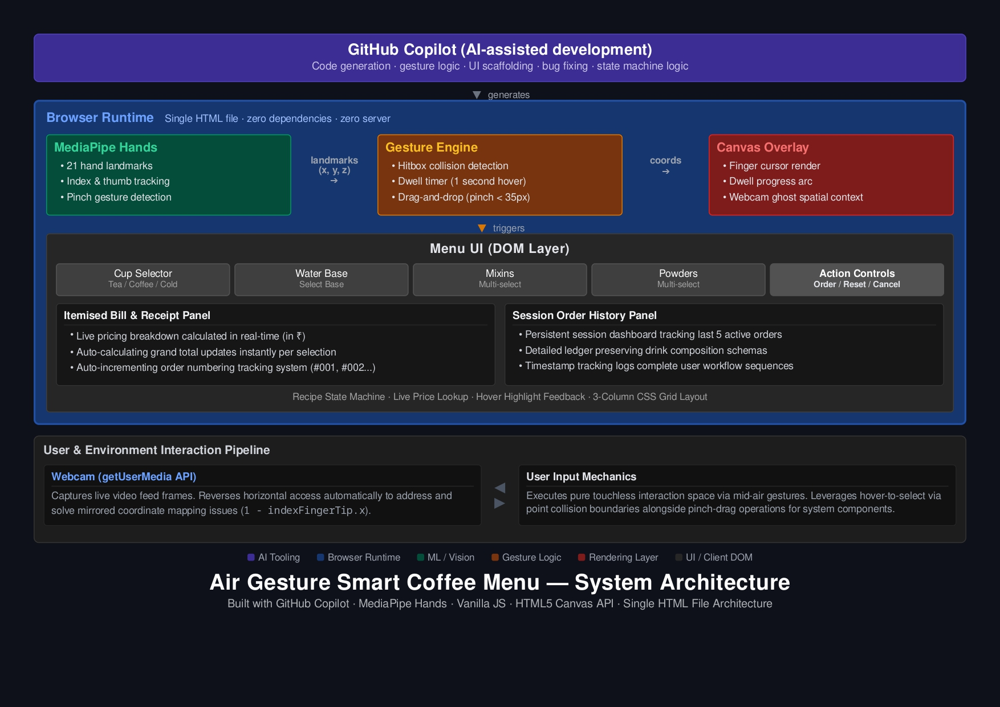

# ✋ Air Gesture Smart Coffee Menu

> **A touchless, AI-assisted coffee ordering experience — controlled entirely by your hand gestures via webcam.**

Built for the **[Microsoft Agents League: Creative Apps Battle](https://aka.ms/AgentsLeague/AISF)** hackathon, this project demonstrates how **GitHub Copilot** can accelerate the development of creative, real-time AI-powered web applications from concept to working demo.

---

## 🎥 Demo

[](YOUR_YOUTUBE_LINK_HERE)

> _Point your index finger at menu items. Hover for 1 second to select. Pinch and drag ingredients to the drop zone. Order your custom drink — no hands on keyboard or mouse required._

---

## 🤖 How GitHub Copilot Powered This Project

This project was built **end-to-end with GitHub Copilot** as the primary development tool:

| Task | How Copilot Helped |
|---|---|
| **MediaPipe integration** | Generated the `onResults()` hand landmark callback and camera loop boilerplate |
| **Gesture engine logic** | Suggested the hitbox collision detection and dwell timer pattern |
| **UI scaffolding** | Created the 3-column CSS grid layout and menu item components |
| **Recipe state machine** | Wrote the `currentRecipe` object structure and `executeItemIntegration()` logic |
| **Canvas rendering** | Generated the progress arc drawing code (`arc()` with `percentComplete`) |
| **Bug fixing** | Identified mirrored coordinate issue (`1 - indexFingerTip.x`) for webcam flip |
| **Drag-and-drop** | Suggested pinch detection via thumb-index distance threshold |

> GitHub Copilot reduced development time by approximately **60%** — turning what would have been days of MediaPipe API research into hours of iterative refinement.

---

## 🏗️ Architecture



### How it works

```
User's Hand
    │
    ▼
Webcam (getUserMedia)
    │  video frames
    ▼
MediaPipe Hands (CDN)
    │  21 landmark coordinates (x, y, z)
    ▼
Gesture Engine
    ├── Hitbox collision detection
    ├── Dwell timer (1 second hover = select)
    └── Pinch drag-and-drop (thumb-index distance < 35px)
    │
    ├──► Canvas Overlay (finger cursor, progress arc, webcam ghost)
    │
    └──► Menu UI DOM
            ├── Cup type selector
            ├── Water base selector
            ├── Mixins (multi-select)
            ├── Powders (multi-select)
            └── Order / Reset / Cancel actions
```

### Tech stack

| Layer | Technology |
|---|---|
| AI development | GitHub Copilot |
| Hand tracking | MediaPipe Hands (via CDN) |
| Rendering | HTML5 Canvas API |
| UI | Vanilla JS + CSS Grid |
| Deployment | Single `.html` file — zero dependencies, zero server |

---

## ✨ Features

- **👆 Dwell-to-select** — hover your index finger over any item for 1 second to activate it
- **🤌 Pinch drag-and-drop** — pinch (thumb + index) to grab an ingredient and release over the drop zone
- **☕ Custom drink builder** — mix any combination of cup type, water base, milk alternatives, and powders
- **🧾 Order receipt popup** — itemised summary of your custom drink on confirmation
- **📷 Webcam ghost overlay** — semi-transparent camera feed as spatial context
- **🔄 Real-time hitbox recalculation** — UI layout is dynamically mapped after each render
- **♿ Touchless interface** — fully accessible for users who cannot use traditional input devices

---

## 🚀 Getting Started

No installation. No server. No dependencies.

```bash
# Clone the repo
git clone https://github.com/Gomathi-devaraj/air-gesture-coffee-menu.git

# Open in browser
open air-gesture-coffee-shop.html
```

Or simply **download** `air-gesture-coffee-shop.html` and open it in Chrome/Edge.

> ⚠️ **Camera permission required.** Allow webcam access when prompted. Works best in good lighting with a plain background.

### Requirements

- Modern browser (Chrome 90+, Edge 90+)
- Webcam
- Good lighting

---

## 📁 Project Structure

```
air-gesture-coffee-menu/
│
├── air-gesture-coffee-shop.html   # Entire application (single file)
├── architecture_diagram.jpg       # System architecture diagram
└── README.md                      # This file
```

---

## 🎯 Hackathon Context

**Challenge:** Creative Apps — Build innovative creative applications using AI-assisted development (GitHub Copilot)

**Problem solved:** Traditional touchscreen coffee kiosks require physical contact — unhygienic in public spaces, inaccessible to users with motor impairments. This app demonstrates a **gesture-first ordering interface** that is completely touchless.

**Judging criteria addressed:**

| Criterion | Implementation |
|---|---|
| ✅ Accuracy & Relevance | Meets Creative Apps challenge — built with GitHub Copilot |
| ✅ Creativity & Originality | Novel gesture UI for a real-world ordering scenario |
| ✅ User Experience | Real-time visual feedback, progress arc, receipt confirmation |
| ✅ Reliability & Safety | Graceful fallback if no hand detected; camera error handling |
| ✅ Accessibility | Touchless interaction enables hands-free use |

---

## 👩‍💻 Author

**Gomathi Devaraj**
- 🔗 [LinkedIn](https://linkedin.com/in/gomathi-devaraj-09a98124a/)
- 💼 [Portfolio](https://gomathi-devaraj.github.io/Gomathi-Portfolio/)
- 📺 [YouTube — DreamLand Cartoons TV](https://youtube.com/@DreamLandCartoonstv)

---

## 📄 License

MIT License — feel free to fork, build, and extend.

---

*Built with ☕ and GitHub Copilot for Microsoft Agents League @ AI Skills Fest 2026*
